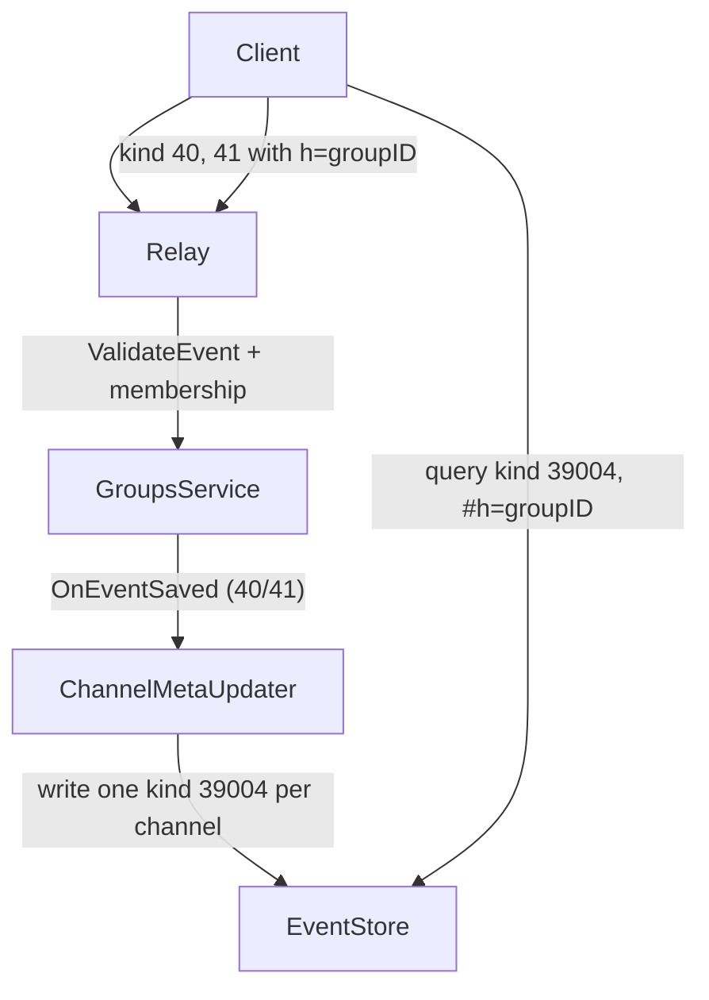

## Per-Channel Relay Metadata for Group Channels

This document describes a scalable way to represent **NIP-28 public chat channels** inside **NIP-29 groups** using **one relay-signed metadata event per channel**, instead of a single group-wide list event.

It is a design/architecture document; implementations may evolve over time.

---

## Overview

### Problem

In a NIP-29 group, it is natural to have **many channels** (e.g. `#general`, `#support`, `#dev`, per-feature threads, etc.).

Using a single relay-generated event that contains **all channels for a group** has drawbacks:

- Event size grows with every new channel and metadata field.
- Updates to one channel require re-emitting the entire list.
- Concurrent updates to different channels are hard to merge safely.
- Snapshots duplicate the full channel list in each new event.

### Approach

Instead, we use:

- **Client-authored NIP-28 events** for channel create / metadata:
  - `kind 40` – channel create
  - `kind 41` – channel metadata
  - (optionally `kind 42`+ for messages, hide/mute, etc.)
- **Relay-signed per-channel metadata events**:
  - One relay-signed event per **(group_id, channel_id)** pair.
  - Small, independently updatable, and easy to query.

Clients:

- Create and update channels using standard NIP-28 events, scoped to a group.
- Discover channels by querying the relay’s per-channel metadata events.

---

## Event Kinds & Responsibilities

### NIP-28 events (client-authored)

Per [NIP-28](https://raw.githubusercontent.com/nostr-protocol/nips/master/28.md):

- `kind 40` – **Channel Create**
  - Defines a new channel, with metadata in `content`.
- `kind 41` – **Channel Metadata**
  - Updates an existing channel’s metadata.
- `kind 42` – **Channel Message** (optional in this doc)
  - Messages posted to channels.
- `kind 43` / `44` – **Hide Message / Mute User** (optional)

For group channels, these events are additionally **scoped to a NIP-29 group** via the `h` tag (see below).

### Relay metadata events (relay-authored)

We reserve a relay-specific kind for **per-channel group metadata**, for example:

- `kind 39004` – **Group Channel Metadata (per channel)**

Responsibilities:

- The **relay** generates and maintains these events in response to accepted `kind 40` and `kind 41` events.
- Exactly **one event per (group_id, channel_id)** is kept as the authoritative snapshot for that channel in that group.
- Older snapshots for the same `(group_id, channel_id)` are deleted/replaced.

---

## Tags & Scoping Rules

### Group scoping (`h` tag)

All group-related NIP-28 events (create, metadata, messages) MUST include:

```text
["h", "<group_id>"]
```

- `group_id` is the NIP-29 group identifier.
- This allows the relay to:
  - Look up the group.
  - Enforce NIP-29 membership rules.
  - Associate the channel with the correct group.

### Channel identity

- The **canonical identity** of a channel is the `id` of its **kind 40 (channel create)** event.
- Within a group, the primary key for a channel is:

```text
(group_id, channel_id)
```

where `channel_id` is the `id` of the kind 40 event.

### Relay metadata event tags

Each per-channel relay metadata event (kind `39004`) uses tags like:

- Group scope:

```text
["h", "<group_id>"]
```

- Deterministic key per channel (for addressable semantics):

```text
["d", "<group_id>:<channel_id>"]
```

  - Example: `["d", "my-group:6f...42"]`.
  - This pairs the group and channel IDs in a single tag.

- Optional reference to the original channel create event:

```text
["e", "<channel_id>"]
```

  - Useful for debugging and for clients that want to retrieve the original `kind 40`.

With these tags, clients can:

- List channels for a group via `kind = 39004` + `#h = [group_id]`.
- Fetch a single channel’s metadata via `kind = 39004` + `#d = [group_id:channel_id]`.

---

## Channel Metadata Schema

Relay metadata events (`kind 39004`) carry channel metadata in their `content` JSON.

Recommended structure:

```json
{
  "id": "<channel_id>",        // ID of the kind 40 event
  "group_id": "<group_id>",    // NIP-29 group identifier

  "name": "General",           // Channel name
  "about": "General chat",     // Optional description
  "picture": "https://...",    // Optional image URL
  "relays": [                  // Suggested relays, per NIP-28
    "wss://relay1.example",
    "wss://relay2.example"
  ],

  "creator": "<pubkey>",       // Pubkey that created the channel (kind 40 author)

  "extra": {                   // Optional app-specific extensions
    "pinned": true,
    "archived": false
  }
}
```

Notes:

- `id` and `group_id` are redundant with tags but convenient for clients.
- `relays` mirrors NIP-28’s `relays` field from channel metadata.
- An `extra` object is recommended for application-specific fields to avoid polluting the top-level namespace.

---

## Authorization & Enforcement

### Channel creation (kind 40)

Relay validation rules (high level):

- Event MUST include `["h", "<group_id>"]`.
- The referenced group MUST exist (e.g. there is NIP-29 metadata / create-group for `group_id`).
- The author MUST be a **member** of the group:
  - Determined via NIP-29 membership logic (admins are also members).
  - Non-members are rejected (e.g. `only group members can create channels`).
- `content`, if present, SHOULD be valid JSON matching the NIP-28 channel metadata shape:
  - `name`, `about`, `picture`, `relays` fields.

If accepted, the relay:

- Treats the event `id` as `channel_id`.
- Seeds or updates a per-channel metadata snapshot (see below).

### Channel metadata (kind 41)

Relay validation rules:

- Event MUST include `["h", "<group_id>"]`.
- Group MUST exist.
- Author MUST be a **member** of the group.
- Event MUST include an `e` tag referencing the channel:

```text
["e", "<channel_id>", ...]
```

- Relay SHOULD verify that:
  - The referenced `channel_id` corresponds to a `kind 40` event.
  - That event has `["h", "<group_id>"]` so the channel actually belongs to that group.
- `content`, if present, SHOULD be valid JSON matching the same metadata shape as in `kind 40`.

If accepted, the relay:

- Updates the per-channel metadata snapshot for `(group_id, channel_id)` with new values.

---

## Relay Metadata Event Lifecycle

For each `(group_id, channel_id)` pair, the relay maintains a **single** authoritative metadata event:

- `kind = 39004`
- `["h", group_id]`
- `["d", group_id:channel_id]`

### On channel create (kind 40)

1. Validate event (group exists, author is member, has `h` tag, JSON is valid).
2. Build initial metadata:
   - `id = channel_id` (from event `id`).
   - `group_id = group_id`.
   - `name`, `about`, `picture`, `relays` from the `kind 40` `content`, if provided.
   - `creator = event.pubkey`.
3. Emit a `kind 39004` **relay-signed** event for `(group_id, channel_id)`:
   - With tags `h`, `d`, optional `e`.
   - With JSON `content` as above.
4. Delete any previous `kind 39004` for the same `d = group_id:channel_id` (if present).

### On channel metadata update (kind 41)

1. Validate event (group exists, author is member, has `h` and `e` tags, target channel belongs to the group, JSON is valid).
2. Load existing `kind 39004` metadata (if any) for `(group_id, channel_id)`.
3. Merge fields:
   - Overwrite `name`, `about`, `picture`, `relays` from the `kind 41` `content` if present.
   - Leave `creator` unchanged.
4. Emit a new `kind 39004` event for `(group_id, channel_id)` with updated JSON `content`.
5. Delete the previous `kind 39004` for that `(group_id, channel_id)`.

This keeps the per-channel metadata small and up to date.

---

## Client Workflows

### 1. Create a channel in a group

Client sends a NIP-28 channel create event:

```json
{
  "kind": 40,
  "content": "{\"name\":\"General\",\"about\":\"General discussion\",\"picture\":\"https://example.com/general.png\",\"relays\":[\"wss://relay.example\"]}",
  "tags": [
    ["h", "<group_id>"]
  ]
}
```

Relay, if the author is a group member and the group exists:

- Accepts the event.
- Derives `channel_id` from the event’s `id`.
- Emits a `kind 39004` metadata event for `(group_id, channel_id)`.

### 2. Update channel metadata

Client sends a NIP-28 channel metadata event:

```json
{
  "kind": 41,
  "content": "{\"name\":\"General\",\"about\":\"General (English only)\"}",
  "tags": [
    ["h", "<group_id>"],
    ["e", "<channel_id>", "", "root"]
  ]
}
```

Relay:

- Validates group membership and that `<channel_id>` belongs to `<group_id>`.
- Merges updated metadata fields.
- Re-emits a `kind 39004` event for `(group_id, channel_id)` with updated JSON.

### 3. List channels in a group

Client queries:

```json
{
  "kinds": [39004],
  "#h": ["<group_id>"]
}
```

Relay returns all per-channel metadata events for that group.  
Client can list channels by reading each event’s `content` JSON.

### 4. Fetch one channel’s metadata

Client queries:

```json
{
  "kinds": [39004],
  "#d": ["<group_id>:<channel_id>"]
}
```

This returns the single per-channel metadata event for that `(group_id, channel_id)`.

---

## Client Implementation

This section describes how the Comunifi client implements NIP-28 channels for NIP-29 groups.

### Channel-Tag Unification

In Comunifi, **channels are exposed to users as tags**. Every group message is posted to a channel, which appears as a `#tag` in the user interface. This provides a familiar, tag-like experience while leveraging the structured channel system.

### Default Channel Behavior

- **All messages are in a channel**: Messages without an explicit `#tag` are automatically assigned to the `#general` channel.
- **Auto-creation**: When a user types a new `#tag` in a group message, the client automatically creates a new NIP-28 channel (kind 40) for that tag if it doesn't already exist.
- **Synthetic #general**: If no `#general` channel exists in the relay metadata, the client provides a synthetic one until it's created on first use.

### Channel Discovery and State

1. **On group selection**: When a user selects a group, the client:
   - Queries for `kind 39004` events with `#h = [group_id]` to fetch existing channels
   - Subscribes to `kind 39004` events to receive real-time channel updates
   - Maintains a per-group channel list sorted with `#general` first, then alphabetically

2. **Channel metadata parsing**: The client parses `kind 39004` events using `GroupChannelMetadata.fromNostrEvent()`, extracting:
   - Channel ID from JSON `id` field or `['e', channel_id]` tag
   - Group ID from JSON `group_id` field or `['h', group_id]` tag
   - Name, about, picture, relays, creator from JSON content

### Message Publishing with Channels

When a user posts a message in a group:

1. **Extract hashtags**: The client extracts hashtags from message content using `NostrEventModel.extractHashtagsFromContent()`
2. **Determine primary channel**: 
   - Use the first hashtag if present, OR
   - Default to `'general'` if no hashtags found
3. **Ensure channel exists**: Call `ensureChannelForTag()` which:
   - Checks if channel already exists in local cache
   - If not, creates it via `NostrService.createChannel()` (kind 40)
   - Returns channel metadata (optimistic if just created)
4. **Tag the message**: Add tags to the kind 1 event:
   - `['t', primaryChannelTag]` - Hashtag tag for the primary channel
   - `['e', channelId, relayUrl, 'root']` - NIP-28 channel reference tag
   - Any additional hashtags as `['t', tag]` tags
5. **Encrypt and publish**: The message is encrypted with MLS and wrapped in kind 1059 as usual

### Message Filtering by Channel

The client filters group messages by the active channel:

- **Active channel selection**: Users can select a channel via horizontal chips in the UI
- **Message filtering**: `GroupState.groupMessages` getter filters messages where `_primaryChannelForEvent(event) == activeChannelName`
- **Channel resolution**: For reading messages, the client determines the channel by:
  1. Checking for explicit `['e', channelId, ..., 'root']` tag (NIP-28 channel reference)
  2. Falling back to first hashtag in content
  3. Defaulting to `'general'` if neither is found

### User Interface

- **Channel chips bar**: Horizontal, scrollable chips displayed below the group header showing all channels for the active group
- **Active channel indicator**: The selected channel chip is highlighted (blue background)
- **Composer channel label**: Shows "Posting in #<channelName>" above the message composer
- **Channel switching**: Tapping a channel chip filters messages to that channel and updates the active channel

### Backwards Compatibility

For existing messages that lack channel information:
- Messages without channel tags are treated as belonging to `#general`
- Old groups immediately have a `#general` view without requiring data migration
- The client gracefully handles messages with missing or invalid channel references

---

## Rationale vs Single Snapshot

### Advantages of per-channel metadata

- **Scalability**:
  - Each event stays small, regardless of how many channels exist in the group.
  - No risk of hitting relay size limits due to a huge JSON list.
- **Efficient updates**:
  - Updating one channel’s name or picture only touches that channel’s metadata event.
  - No need to rebuild and re-sign a full list of all channels.
- **Better concurrency**:
  - Independent channels can be updated in parallel without overwriting each other’s changes.
- **Storage behavior**:
  - Per-channel events only duplicate the metadata for that channel, not for all channels.

### Trade-offs

- **Listing all channels** now means:
  - Scanning multiple `kind 39004` events instead of reading one large snapshot.
  - However, filtering by `kind` and `#h` is straightforward and efficient in modern nostr relays.
- **Indexing / ordering**:
  - Ordering (by creation time, name, activity) is client-side or via additional server conventions.
  - This can be improved later with additional tags or separate index events if needed.

---

## Migration Considerations

If an earlier version of the relay used a **single group-wide channels snapshot** (e.g. one `kind 39004` event per group containing an array of all channels), migrating to per-channel metadata implies:

- **Client changes**:
  - Update channel listing to query **multiple** `kind 39004` events by `#h = group_id`.
  - Update single-channel fetch to query `#d = group_id:channel_id` rather than scanning an in-memory list.
- **Relay changes**:
  - Transition the meaning of `kind 39004` from “group snapshot” to “per-channel metadata” or introduce a distinct new kind for per-channel events.
  - Optionally support both formats during a migration window:
    - Emit per-channel events for new/updated channels.
    - Continue updating the group snapshot event for backward compatibility until all clients migrate.
- **Data backfill**:
  - A one-off migration tool can:
    - Read existing channel definitions.
    - Emit initial per-channel `kind 39004` events for each `(group_id, channel_id)`.

For new deployments, using per-channel metadata from the start avoids these migration steps.

---

## Data Flow Diagram



